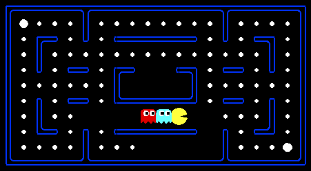

<h1> 
Pacman Multi-Agent Project

<br>

</h1>

This repository is set up as a complete Python project with:

- a `pyproject.toml` project configuration
- `pytest`-based test hooks that execute the existing Pacman autograder questions
- `Taskfile.yml` as the single source of truth for test commands
- GitHub Actions CI to run tests on push and pull request

## Project Structure

* `app/`: Pacman source code reorganized with MVC + Agent-Based architecture
* `app/model/`, `app/view/`, `app/controller/`: MVC layers
* `app/agents/`: agent implementations (`Reflex`, `Minimax`, `AlphaBeta`, `Expectimax`, etc.)
* `app/testing/`: autograder and grading internals
* `app/config/`: project parameter configuration for autograder
* `tests/`: assignment `.test` files and pytest bridge
* `solutions/`: assignment `.solution` files (split from tests)
- `Taskfile.yml`: reusable local/CI task definitions
- `.vscode/tasks.json`: VS Code bindings to Taskfile tasks
- `.github/workflows/q1.yml` ... `.github/workflows/q5.yml`: per-question CI workflows

## Local Setup (.venv)

Recommended: use [`uv`](https://docs.astral.sh/uv/) for environment and dependency management.

```bash
uv sync
```

If you prefer manual setup with `.venv`, use the steps below.

Create virtual environment (if needed):

```powershell
python -m venv .venv
```

Install development dependencies:

```powershell
.venv\Scripts\python.exe -m ensurepip --upgrade
.venv\Scripts\python.exe -m pip install --upgrade pip uv
uv sync --group dev
```

## Run Tests (Taskfile)

Install Task runner (one-time):

> You can see another installation method on the official [Taskfile website](https://taskfile.dev/docs/installation).

```bash
# Windows (Scoop)
scoop install task

# macOS (Homebrew)
brew install go-task

# Linux/macOS (official install script)
sh -c "$(curl --location https://taskfile.dev/install.sh)" -- -d
```

Then run tests through Taskfile:

```bash
task test
task test:fast
task test:slow
task test:q2
task test:q2q3
```

Run graphical simulation:

```bash
task run:pacman
```

By default, `task run:pacman` opens an interactive launcher before execution.
After each game finishes, the launcher prints a detailed status log and returns to the main menu.

You can configure multiple parameters first (Agent, Layout, Ghosts, Games), then return to the main menu and choose `Execute` to start.

The launcher now includes:

- Colorized CLI output for better readability
- A live description panel for the currently selected menu item
- A clear key legend inside the UI

- Up/Down arrows: move selection
- `Space` or `Enter`: select the focused option
- Number keys `1..9`: quick-select by option index
- `q`: quit launcher (without running)

Optional overrides:

```bash
PACMAN_AGENT=ExpectimaxAgent PACMAN_LAYOUT=minimaxClassic PACMAN_GHOSTS=2 task run:pacman
```

When launch parameters are provided (`PACMAN_AGENT`, `PACMAN_LAYOUT`, `PACMAN_GHOSTS`, `PACMAN_GAMES`, `PACMAN_EXTRA_ARGS`), the launcher skips the interactive menu and runs directly.

Direct module-mode examples (without Taskfile):

```bash
PYTHONPATH=app .venv/Scripts/python.exe -m controller.pacman -p ReflexAgent -l mediumClassic -k 2
```

```bash
cd app
../.venv/Scripts/python.exe -m testing.autograder -q q2 --no-graphics
```

Note: Taskfile is configured to try `uv run` first for Python commands, and automatically fallback to regular Python when `uv` is unavailable.

If you want Taskfile to use a specific interpreter:

```bash
PYTHON_BIN=/path/to/python task test
```

PowerShell:

```powershell
$env:PYTHON_BIN = "<path-to-python>"
task test
```

## Run Tests (Direct pytest)

Run all hooked autograder tests through pytest:

```powershell
.venv\Scripts\python.exe -m pytest
```

Run only selected question(s):

```powershell
$env:PACMAN_QUESTIONS="q2,q3"
.venv\Scripts\python.exe -m pytest
```

Run only slow checks (currently Q5):

```powershell
.venv\Scripts\python.exe -m pytest -m slow
```

## CI Behavior

Workflow files: `.github/workflows/q1.yml` ... `.github/workflows/q5.yml`

- each question has its own workflow (`CI Q1` ... `CI Q5`)
- every workflow triggers on `push` to `main` and all pull requests
- every workflow uses Python `3.11` only
- every workflow installs and uses Task runner
- each workflow executes one Taskfile target (`task test:q1` ... `task test:q5`)
- skip CI by starting your commit message with `[skip ci]` on push
- skip CI on pull request by starting PR title with `[skip ci]`
